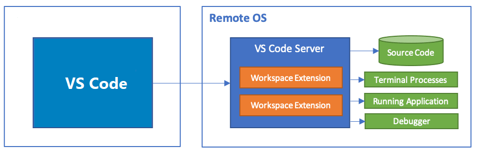

# VSCode Architecture Analysis - Electron Project Cross-Platform Best Practices

## Preface

VSCode is arguably the most well-known Electron application. Since it was open sourced, it has become one of the most successful IDEs (Editors) in the world thanks to Microsoft's continuous improvement and addition of new capabilities. Now, VSCode is no longer just a local application, but supports a complete set of product solutions in Web, Native, and Remote scenarios. Currently, the VSCode product line includes VSCode, vscode.dev, github.dev, code-server, etc. products. Surprisingly, these applications were all developed in a non-monorepo repository, and most of their functionality is isomorphic. This article will show what architectural designs VSCode has adopted to achieve isomorphic cross-platform (Native & Web & Remote) capabilities, and will be supplemented by a small amount of source code to analyze the significance of each design concept. This article assumes that the reader has a basic understanding of Electron.

Before conducting specific architectural analysis, we need to clarify the concepts of isomorphism and cross-platform.

### Isomorphism

Isomorphism refers to developing a program that can run on different platforms. For example, developing a piece of js code can be used by a web server and a browser developed based on node.js at the same time. Since the Web side is naturally restricted to some system calls (such as fs reading, etc.), it is impossible to implement completely isomorphic code in VSCode. The isomorphism mentioned in this article refers more to how to abstract public Ability to reduce the amount of code differences between different platforms.

### Cross-platform

Benefiting from Electron's Chromium-based architecture, Electron App naturally supports running under different operating systems, so the cross-platform concept is not the focus of this article. The cross-platform mentioned in this article refers more to how to ensure that the application can be opened in the Electron App and the browser at the same time. In other words, cross-platform refers to cross-electron and web platforms. In addition, in the design of VSCode, additional cross-platform requirements for Remote have been added, that is, it supports connecting to cloud machines in local VSCode (Web & Native). In short, the cross-platform nature of VSCode is to achieve the following two capabilities:

1. Isomorphism between Web & Native
2. Isomorphism between Native & Remote

## Isomorphism between Web & Native

Ignoring the dependency running environment is a frequent factor that causes the Electron Render process to fail to run in the browser. On the other hand, the core of cross-platform capabilities also lies in the management of dependencies. For example, suppose we want to implement the function of prompting a pop-up window hello to the user after clicking a button. A very direct implementation method is as follows:

```Typescript
// Electron Render environment
function onClickButton() {
   ipcRender.invoke("showMessage", "hello!"); // it works
}
button.onclick = onClickButton;
```

However, when we run the project in the browser, this simple line of `ipcRender.invoke` will cause the project to report an error. In this specific case, it may only cause a button click failure, but what if our initialization process also relies on ipc calls? For example, when reading the user's configuration language during initialization, in this scenario, an error may result in a white screen on the page.

In order to avoid these phenomena, VSCode has made the following designs:

* Clarify the code running environment from the file structure
* Inversion of control through dependency injection
* Register special capabilities for specific platforms based on the plug-in mechanism

### Design and dependency control of project file organization structure

Observing the VSCode core logic implementation code folder `vscode/src/vs/platform`, we can find that browser, common, electron-main, electron-sandbox, node, and test folders are fixedly placed under each sub-function folder, which is obviously represents the running environment of the code in the folder.

```txt
➜  vscode git:(main) ✗ tree src/vs/platform -L 2
src/vs/platform
├── accessibility
│   ├── browser
│   ├── common
│   └── test
├── action
│   └── common
├── actions
│   ├── browser
│   ├── common
│   └── test
├── assignment
│   └── common
├── backup
│   ├── common
│   ├── electron-main
│   ├── node
│   └── test
├── checksum
│   ├── common
│   ├── node
│   └── test
├── clipboard
│   ├── browser
│   ├── common
│   └── test
## ...
├── windows
│   ├── electron-main
│   ├── node
│   └── test
├── workspace
│   ├── common
│   └── test
└── workspaces
    ├── common
    ├── electron-main
    ├── node
    └── test

273 directories, 0 files
```

The key to this design is to provide crucial meta-information (running environment) for several subsequent governance methods. As a cornerstone, it ensures the feasibility of the dependency injection function. Its specific value will be more clearly demonstrated in subsequent content. 

### Dependency injection

Dependency injection is the most important part of the entire VSCode cross-platform architecture. It can be said that other designs only assist or supplement it. This article does not analyze the concept of dependency injection and its specific implementation in VSCode in detail.

Let's go back to the example mentioned above and implement the cross-platform button prompt function using simple ideas and dependency injection ideas respectively, so as to observe the advantages of dependency injection.

#### Simple implementation

Idea: Notice that ipcRender cannot be called in the Web environment, so if else is used to distinguish the execution logic in different environments.

```Typescript
function onClickButton() {
  if (CURRENT_ENVIRONMENT === 'electron-browser') // electron
    (await import('electron')).ipcRender.invoke("showMessage", 'hello!');
  else // web
    alert('hello')
}
button.onclick = onClickButton
```

Although it implements the required functions, it also ensures that the code can run in Web & Electron. However, as the usage of ipcRender increases, the cyclomatic complexity of the code will increase significantly, which will affect the readability and efficiency of the project. And because there is no unified architecture design, the methods of implementing calls will also be strange, thus greatly improving the ability to manage subsequent functions (in other words, it is difficult to upgrade the interface).

#### Dependency injection implementation

Idea: Abstract an IMessageService interface, which defines the showMessage method, implement this interface under electron-sandbox and Web respectively, obtain the object instantiated in the current environment in the view and bind the method.

```TypeScript
// common/message.ts
const IMessageService = Symbol("IMessageService");
interface IMessageService {
  showMessage(message: string): void;
}

// electron-sandbox/messageService.ts
class MessageService implements IMessageService {
  showMessage(message: string): void {
    ipcRender.invoke("showMessage", message);
  }
}
collection.registry(IMessageService, new MessageService());

// browser/messageService.ts
class MessageService implements IMessageService {
  showMessage(message: string): void {
    alert(message);
  }
}
collection.registry(IMessageService, new MessageService());

// browser/button.ts
const messageService = collection.get(IMessageService);
button.onclick = function () {
  messageService.showMessage("hello");
};
```

#### Analyze

For such a simple function, the implementation of dependency injection is indeed more complicated and requires more code. However, if you only focus on the core logic (browser/button.ts file), the dependency injection pattern is obviously clearer and more concise. Moreover, the development cost of dependency injection is one-time: after implementing dependency injection, there is no need to add if else judgments when calling the corresponding service methods. In the long run, the code volume and complexity of the entire project will definitely decrease. The complexity of a project is only positively related to the number of lines of code, but the complexity of different projects has completely different growth curves with the number of lines of code. From this perspective, dependency injection is obviously an ideal solution for large projects.

#### Cross-process inter-service calls

Another benefit brought by dependency injection is that it greatly simplifies the cost of calling services across processes. Benefiting from the dependency injection architecture, VSCode's functions are organized in the form of Class and have a relatively consistent structure and common conventions. Based on these backgrounds, VSCode can easily complete the proxy and packaging of cross-process services, thereby conveniently completing cross-process service calls. Compared with the manual registration of Electron Channel, this Proxy-based method not only enjoys the powerful type checking support of TypeScript, but also automates the process of registering the channel.

```TypeScript
export function fromService<TContext>(
  service: unknown,
  options?: ICreateServiceChannelOptions
): IServerChannel<TContext> {
  const handler = service as { [key: string]: unknown };
  const disableMarshalling = options && options.disableMarshalling;

  // Buffer any event that should be supported by
  // iterating over all property keys and finding them
  const mapEventNameToEvent = new Map<string, Event<unknown>>();
  for (const key in handler) {
    if (propertyIsEvent(key)) {
      mapEventNameToEvent.set(
        key,
        Event.buffer(handler[key] as Event<unknown>, true)
      );
    }
  }

  return new (class implements IServerChannel {
    listen<T>(_: unknown, event: string, arg: any): Event<T> {
      const eventImpl = mapEventNameToEvent.get(event);
      if (eventImpl) {
        return eventImpl as Event<T>;
      }

      if (propertyIsDynamicEvent(event)) {
        const target = handler[event];
        if (typeof target === "function") {
          return target.call(handler, arg);
        }
      }

      throw new Error(`Event not found: ${event}`);
    }

    call(_: unknown, command: string, args?: any[]): Promise<any> {
      const target = handler[command];
      if (typeof target === "function") {
        // Revive unless marshalling disabled
        if (!disableMarshalling && Array.isArray(args)) {
          for (let i = 0; i < args.length; i++) {
            args[i] = revive(args[i]);
          }
        }

        return target.apply(handler, args);
      }

      throw new Error(`Method not found: ${command}`);
    }
  })();
}

export function toService<T extends object>(
  channel: IChannel,
  options?: ICreateProxyServiceOptions
): T {
  const disableMarshalling = options && options.disableMarshalling;

  return new Proxy(
    {},
    {
      get(_target: T, propKey: PropertyKey) {
        if (typeof propKey === "string") {
          // Check for predefined values
          if (options?.properties?.has(propKey)) {
            return options.properties.get(propKey);
          }

          // Dynamic Event
          if (propertyIsDynamicEvent(propKey)) {
            return function (arg: any) {
              return channel.listen(propKey, arg);
            };
          }

          // Event
          if (propertyIsEvent(propKey)) {
            return channel.listen(propKey);
          }

          // Function
          return async function (...args: any[]) {
            // Add context if any
            let methodArgs: any[];
            if (options && !isUndefinedOrNull(options.context)) {
              methodArgs = [options.context, ...args];
            } else {
              methodArgs = args;
            }

            const result = await channel.call(propKey, methodArgs);

            // Revive unless marshalling disabled
            if (!disableMarshalling) {
              return revive(result);
            }

            return result;
          };
        }

        throw new Error(`Property not found: ${String(propKey)}`);
      },
    }
  ) as T;
}
```

### Register special capabilities for specific platforms based on the plug-in mechanism

Benefiting from VSCode's exquisitely designed plug-in system, VSCode can extract some non-core capabilities from the code and place them in plug-ins for implementation. For example, VSCode's JavaScript debugging capabilities are actually implemented in the built-in plug-in Node Debug Auto-attach. On the Web, you only need to remove such plug-ins from the built product to delete related capabilities. In the same way, some capabilities necessary in the Web can also be provided in the form of built-in plug-ins. For example, the GitHub Pull Requests and Issues plug-in is built-in and installed under github.dev to support users to conveniently conduct Code Review in the application. By increasing or decreasing the number of built-in plug-ins, the complexity of the logic circle in the core code of VSCode can be further reduced, thus ensuring the performance and complexity of VSCode itself.

## Isomorphism between Native & Remote

### Abstraction of process structure

There is no doubt that VSCode Remote series capabilities (Remote SSH, code-server...) are one of its core competitive capabilities that distinguish it from other IDEs. In order to achieve a consistent experience between Remote connection and local Electron App, VSCode encapsulates a complete set of ipc communication protocols to smooth the differences between local VSCode and connected cloud services. Its architecture diagram is as follows:



When the user uses the VSCode App, it communicates with the VSCode Server running locally through the ipc interface provided by Electron. In code-server or SSH mode, the Render process communicates with the server in the cloud through the websocket or SSH protocol. The only difference is the communication protocol, and the return results of the calling methods are basically the same. Through such an architectural design, VSCode ensures the consistency of experience between Native & Remote, and also lays a solid foundation for the success of the VSCode Remote series capabilities.

```TypeScript
// src/vs/base/parts/ipc/common/ipc.ts
/**
 * An `IChannel` is an abstraction over a collection of commands.
 * You can `call` several commands on a channel, each taking at
 * most one single argument. A `call` always returns a promise
 * with at most one single return value.
 */
export interface IChannel {
  call<T>(
    command: string,
    arg?: any,
    cancellationToken?: CancellationToken
  ): Promise<T>;
  listen<T>(event: string, arg?: any): Event<T>;
}

/**
 * An `IServerChannel` is the counter part to `IChannel`,
 * on the server-side. You should implement this interface
 * if you'd like to handle remote promises or events.
 */
export interface IServerChannel<TContext = string> {
  call<T>(
    ctx: TContext,
    command: string,
    arg?: any,
    cancellationToken?: CancellationToken
  ): Promise<T>;
  listen<T>(ctx: TContext, event: string, arg?: any): Event<T>;
}

// src/vs/base/parts/ipc/electron-sandbox/ipc.electron.ts
/**
 * An implementation of `IPCClient` on top of Electron `ipcRenderer` IPC communication
 * provided from sandbox globals (via preload script).
 */
export class Client extends IPCClient implements IDisposable {
  private protocol: ElectronProtocol;

  private static createProtocol(): ElectronProtocol {
    const onMessage = Event.fromNodeEventEmitter<VSBuffer>(
      ipcRenderer,
      "vscode:message",
      (_, message) => VSBuffer.wrap(message)
    );
    ipcRenderer.send("vscode:hello");

    return new ElectronProtocol(ipcRenderer, onMessage);
  }

  constructor(id: string) {
    const protocol = Client.createProtocol();
    super(protocol, id);

    this.protocol = protocol;
  }

  override dispose(): void {
    this.protocol.disconnect();
  }
}

// src/vs/base/parts/ipc/common/ipc.net.ts
export class Protocol extends Disposable implements IMessagePassingProtocol {
  private _socket: ISocket;
  private _socketWriter: ProtocolWriter;
  private _socketReader: ProtocolReader;

  private readonly _onMessage = new Emitter<VSBuffer>();
  readonly onMessage: Event<VSBuffer> = this._onMessage.event;

  private readonly _onDidDispose = new Emitter<void>();
  readonly onDidDispose: Event<void> = this._onDidDispose.event;

  constructor(socket: ISocket) {
    super();
    this._socket = socket;
    this._socketWriter = this._register(new ProtocolWriter(this._socket));
    this._socketReader = this._register(new ProtocolReader(this._socket));

    this._register(
      this._socketReader.onMessage((msg) => {
        if (msg.type === ProtocolMessageType.Regular) {
          this._onMessage.fire(msg.data);
        }
      })
    );

    this._register(this._socket.onClose(() => this._onDidDispose.fire()));
  }

  drain(): Promise<void> {
    return this._socketWriter.drain();
  }

  getSocket(): ISocket {
    return this._socket;
  }

  sendDisconnect(): void {
    // Nothing to do...
  }

  send(buffer: VSBuffer): void {
    this._socketWriter.write(
      new ProtocolMessage(ProtocolMessageType.Regular, 0, 0, buffer)
    );
  }
}

export class Client<TContext = string> extends IPCClient<TContext> {
  static fromSocket<TContext = string>(
    socket: ISocket,
    id: TContext
  ): Client<TContext> {
    return new Client(new Protocol(socket), id);
  }

  get onDidDispose(): Event<void> {
    return this.protocol.onDidDispose;
  }

  constructor(
    private protocol: Protocol | PersistentProtocol,
    id: TContext,
    ipcLogger: IIPCLogger | null = null
  ) {
    super(protocol, id, ipcLogger);
  }

  override dispose(): void {
    super.dispose();
    const socket = this.protocol.getSocket();
    this.protocol.sendDisconnect();
    this.protocol.dispose();
    socket.end();
  }
}
```

## References

### vscode server

* https://code.visualstudio.com/blogs/2021/10/20/vscode-dev
* https://code.visualstudio.com/blogs/2022/07/07/vscode-server
* https://code.visualstudio.com/docs/remote/vscode-server
* https://www.youtube.com/watch?v=sy3TUb_iVJM

### contribute

* https://www.wendell.fun/posts/vscode-contrib

[[status/ArticlePublished]] [[status/Archived]]
