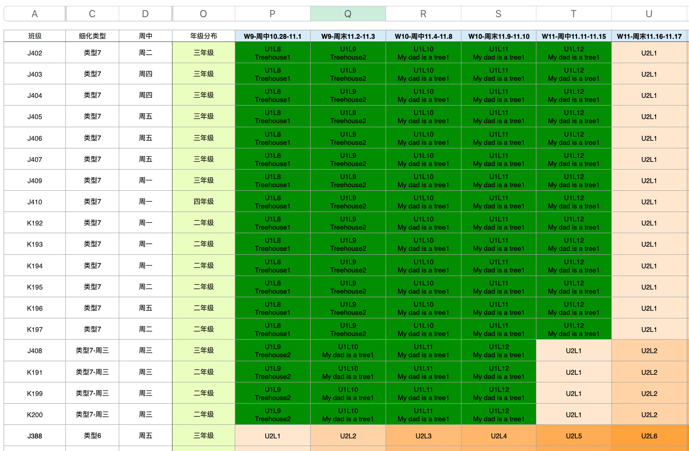
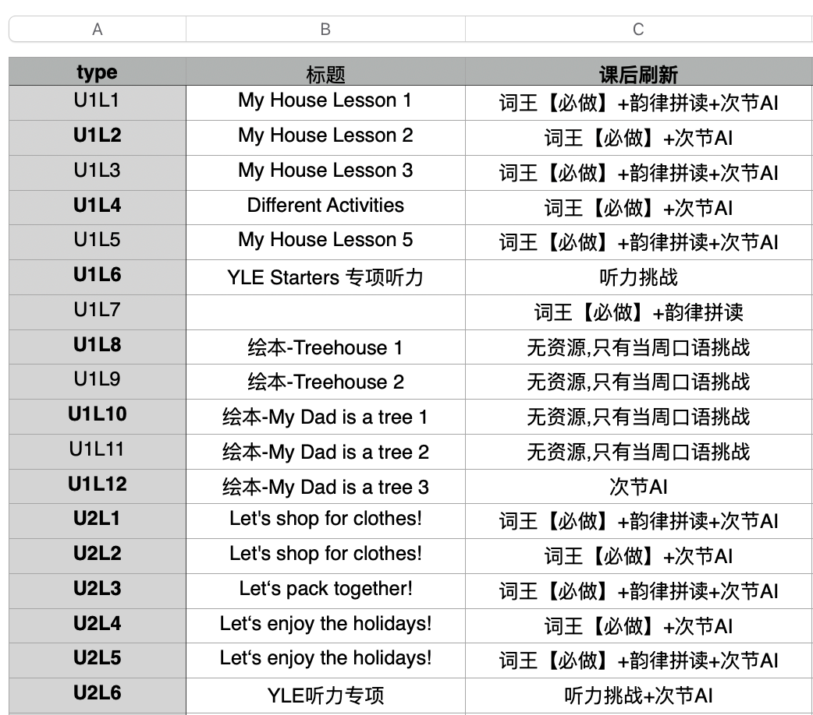
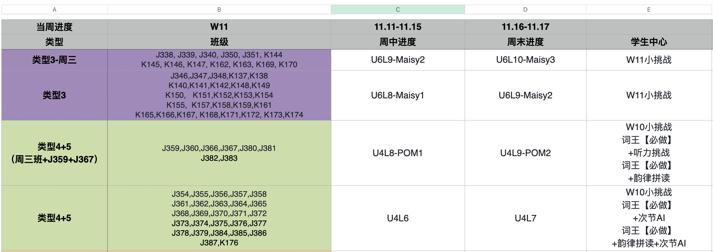
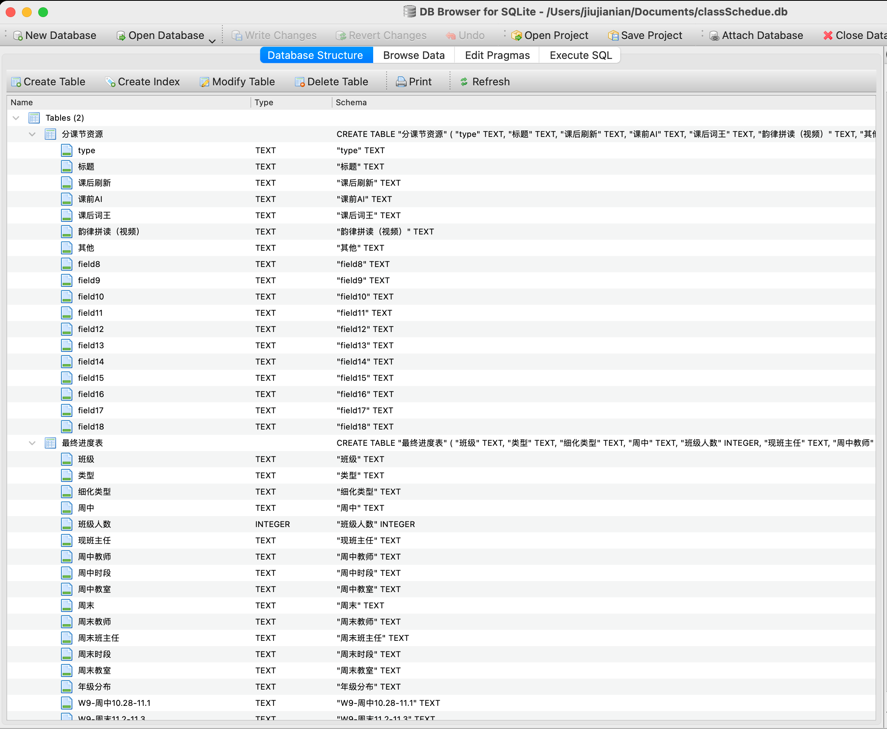
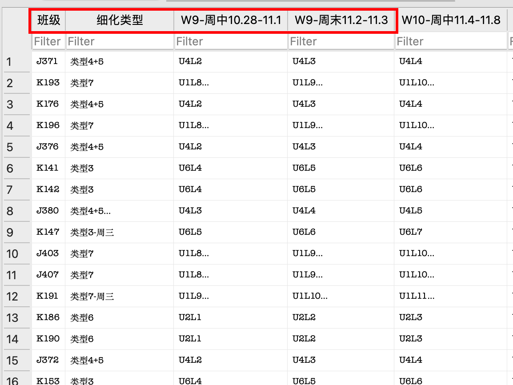
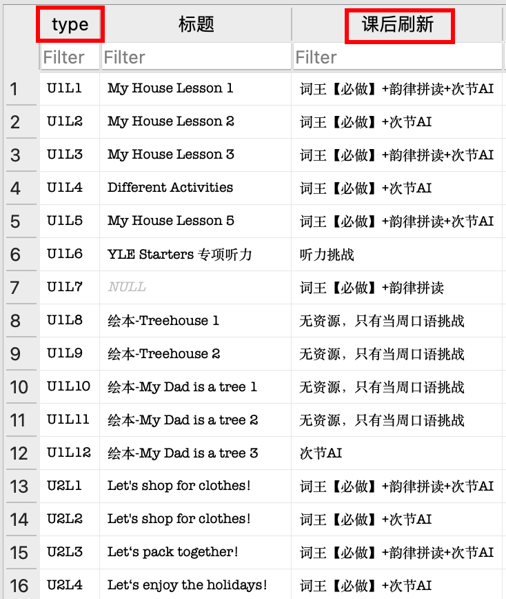
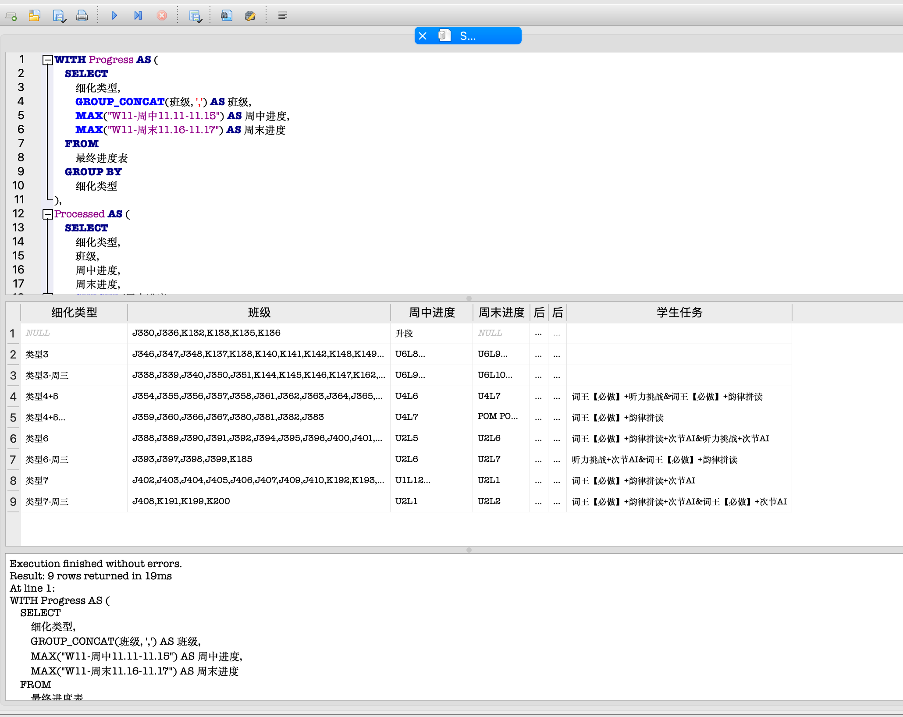

# AI 赋能非研发人员数据处理工作的思考与一个简单实践

## 背景

离职后这段时间非常充裕，因而也让我有更多的精力去探讨思考 AI 对普通人到底能带来什么价值。在与朋友经过一段时间较为深入的共同探索之后，我发现在限定为 "不会编程的普通人" 的背景下，AI 最容易为其工作完成赋能的领域为数据处理。
这既是最容易让普通人快速掌握，又是能极大提高他们工作生产效率的一个方向。
在此，我简单阐述一下我的观察和相关的一些思考，相信对无论是相关方向的从业者，还是想要通过 AI 提升自己工作生产力的朋友都会有一定的启发。

为什么数据处理是最切实可行的赋能普通人的一个方向？我认为影响我做出这个判断的原因有以下几点：

首先是数据处理的普遍性。
在一个信息化的时代，无论是不是处在科技行业，我们都不可避免地与大量的数据打交道。
最显著的区别，也无非就是数据的数量或者处理数据的载体，可能科技公司用数据库更多，而传统行业更倾向于使用 Excel。但本质上数据处理的内核没有区别。而且大家要面对的数据量都会是人力难以轻松完成的，至少人工处理数据会异常麻烦。
换句话说，数据处理的工作既普遍，并且也确实是占用人们日常工作中极大时间的一项任务。这在传统行业可能更为明显，因为他们的数据处理流程更依赖一些手工而非自动化的行为。

其次是数据处理本身并不是非常复杂。
无论处在什么行业，我们要面对的数据大概率都是结构化或者至少半结构化的数据。也就是说，它通常不是散漫地分布在一个纯文本文件或者类似的结构中，而是至少会有一个类似 Excel 表格这样的数据载体。这样的形式天然约束了它拥有固定的标准化模式结构。
而且很容易发现，常用的数据分析手段和处理逻辑也都非常标准：无非是那几个常用的处理公式，只不过是每次会有一些排列组合上的变化而已。
换句话说，整个数据分析的流程是极其标准化的，而不像是一些其他的工作任务拥有各式各样的形态。

还有就是数据本身足够原子化，描述数据提供背景信息的成本不高。
我们在完成数据处理的过程中，常见的处理步骤就是输入一张底表（也就是数据源），经过一些公式的分析得出具体的结果。在这个过程中，我们依赖的外部信息仅仅是底表数据这一个变量，而不需要引入其他太多复杂的外界知识。
相当于，我们要处理的问题复杂度是收敛的，这也为我们将全部的上下文描述给 AI 提供了可能，不需要复杂的准备就能将背景知识完全描述。这是降低使用 AI 成本的一个重要组成部分。

再者，数据是一项无论什么行业都非常核心的资产。
换句话说，人们普遍意识到数据拥有巨大的价值。也因此有很多的商业或非商业产品在解决与数据处理相关的问题。
数据处理是一项成熟的产业，它有标准的操作流程以及非常成熟的一系列软件来支持这样的行为。那这就为我们，尤其是使用一些自动化的程序来处理数据提供了可能。而又因为其是一项在计算机业界有着非常广泛研究的领域，AI 本身也非常擅长完成这项任务，而不像是处理一些小众领域时，AI 自身就不具有足够的背景知识储备。

普遍、标准化、拥有成熟解决方案，但与此同时，它又明显地占据很多人的大量日常工作精力。种种条件相加起来，使它很容易地成为一项值得人们去优化的工作流程。

## 实践

当然，这些结论本身其实比较显而易见，大家并不难看出这些数据分析的特点。但我觉得一个在 AI 应用领域的从业者，以及真正的需求方，即那些非互联网科技行业工作、但有数据分析处理需求的人之间，最大的鸿沟在于，他们对对方没有足够的认识：
能简单完成数据处理自动化工作的人并不知道具体需求是什么，而那些需要帮助的人也并不太清楚当下遇到的问题如何解决、是否能解决。

在此，我用一个我切实帮人解决问题的经历作为例子，希望可以让那些非编程背景的朋友能更容易的理解 “究竟如何用 AI 来辅助自己完成自动化工作”，也让 AI 应用领域的同行们了解一些我观察到的用户需求。

### 背景

我的朋友是一位小学培训机构的年级组长，她需要负责对本年级所有班级的学期课程安排进行排班，并在每一周开始之前确定当周各个班级都需要上具体哪几节课程。此外，由于每个课程具体的课后作业和额外任务都不一样，她还需要额外备注本周课程需要学生课后完成的作业，并将结果绘制成表格通知给各个上课老师。

虽然整学期的课程安排已经在学期开始之前制定完成，并且存入到了一张 Apple Numbers 表格中，但由于不同班级进度不同，以及假期对课程安排造成的影响，所以在每一周中，不同类型班级需要开设的课程都不尽相同。作为年级组长，她现在需要在每周开始前，手工地计算出来各个类型班级都需要在本周开办哪些课程。
这实在是一项繁重、无聊，并且极易出现差错的任务。


<center>图1 进度表示例</center>


<center>图2 课后作业示例</center>


<center>图3 当前周课程安排示例</center>

<br/>

显然的，整个数据处理过程有其非常固定的规律，这是一个可以通过编程自动化解决的工作。但由于我的朋友完全没有编程以及使用 AI 的经验，所以她希望我能帮她通过编程完成这个自动化的工作。

### 解决思路

首先，直接通过编程解决这个问题并不困难，但是我并不太想直接自己写程序来完成这个工作。相反，我把它当成一个探索 AI 协助非程序员（普通人）完成自动化工作的一次机遇。
换句话说，我想尽可能地在完成这个过程中不使用那些依赖需要编程背景的知识，而是让 AI 帮我完成整个编码的流程。也就是，模拟一个不会编程的普通人，通过结合 AI 自动化自己日常工作的作业流程。

### 技术选型

在确定这个前提条件之后，我们首先需要思考如何进行技术选型。
既然我们不假设自己拥有编程的技术研发背景，那我们就应该尽可能地避免使用程序语言来完成这个任务：
因为无论是运行配置环境，还是一些可能出现问题的调试，对于一个非研发来说都是比较复杂的。引入这些背景知识会极大地拖慢整个问题解决的进程和进度。
但使用 Excel 或 Numbers 中的那些公式又非常繁琐，而且其也没有太多成型系统的资料用于学习，所以这也不是我们首选的考虑解决方式。

经过排除以后，我发现使用数据库来解决数据处理的需求相对而言更为合理。这里有几个原因：
首先，数据库有很多现成的客户端，它们提供了可视化交互的能力，而并不只依赖通过终端操作。这就对普通人而言非常的友好，便于他们时刻浏览和检查数据。
其次是使用数据库完成查询本身是一个标准的过程，使用 SQL（也就是数据库的查询语言）来查询数据本身比使用一门正式的程序语言编写程序要简单许多。
SQL 相对其他编程语言来说本身功能受限，但这未必一定是件坏事：功能受限一方面是限制它的能力表现，但另一方面也说明它更加简单，使用难度更低。它显然更适用于数据查询的这项工作（毕竟这就是它的设计目的）。
结合上述提及的背景，我们知道该需求中唯一依赖的外部数据就是那张课程安排的底表，而没有其他额外的外界因素，显然这是可以通过数据库 + SQL 查询解决的工作。

而具体到数据库的选型，还是考虑到用户非编程背景的限制条件，我们还是一切从简、不引入太多复杂的安装流程。由于我的朋友用的是Mac，天生拥有 SQLite 的环境；同时我们的数据查询流程也并不复杂，直接使用 SQLite 我觉得就已足够。
在此之后就是在网上找一个 SQLite 的客户端，提供 GUI 操作能力即可。
下一步则是把 Numbers 转成一个数据库。提问 GPT 可知，这步流程无非就是先把 Numbers 转成若干张 CSV 表格，再创建一个新的数据库，导入这些CSV表格即可。经过一番简单的变换操作，我们就拥有了一个与原先 Numbers 表格中数据完全一致的数据库。


<center>图4 Database</center>

### 数据查询

再之后就是思考怎样将我们需要的数据排查出来。

在请求 AI 帮我们完成编码工作之前，我们得明确本需求的精确描述为何。在我们自己确定了具体需求之后，AI 才有可能理解我们的需求是什么，并帮我们解决问题。

实现需求的过程其实有点像做一道简单的解函数数学题：
我们知道具体的入参（也就是那个数据库），也知道想要的结果是什么。现在我们要做的，就是将我们脑海中的这些概念用文字表达出来，让 AI 也拥有一致的背景知识。再由它帮我们求出来 `y = f(x)` 中的 f，也就是从入参到结果的计算过程，再将这份逻辑转译为数据库可以理解的 SQL。

哪些东西是我们需要的计算结果呢？结合上文提到的需求背景，我们需要的结果有如下几样：

首先，应该是基于班级的类型为所有班级做一次分类；
之后，基于不同的分类查出当前周不同分类下的课程进度（即当前周对应的课程名称）；
然后基于需要完成的课程名称，查询到本周各班级类型需要完成的课后工作。

再来分析，我们都需要提供哪些数据，才能计算出我们需要的上述结果。简单分析可知：

在 “课程进度表” 中，计算结果依赖每个班级的具体细化类型信息，以及班级的名称、当前周课程的进度安排。
而在 “课后作业规划表” 表中，我们需要提供各个课程与课程需完成任务间的对应关系。


<center>图5 课程进度表</center>


<center>图6 课后作业规划表</center>

### 编写 Prompt

然后我们要做的就是写一份拥有全部背景信息的 prompt 告诉 AI，让它帮我们生成一份 SQL。

通常来说，我一般会这样写 SQL prompt：

首先描述我们的背景信息。
对于当前的需求来说，我们拥有一个数据库，其拥有两张表。
第一张表是最终进度表，它有这些这些列。
第二张表是分课节资源，它有这些这些列。
这就是我们需要提供的所有背景知识。

在此之后，我们要描述我们需要获取的是什么东西。其实这一步无非就是把我们上述的分析过程用文字再描述一遍。
也就是首先要求查找出全部细化类型以及各细化类型对应的班级，再其次求出本周各班级当前应该完成哪些课程，最后基于这些课程的名称，查询在对应课程下都需要完成什么课后任务。

在描述完这些背景知识之后，我们还要明确告诉 AI 它应该怎样完成这个任务。具体到这次需求，我需要让它生成 SQL，而非程序语言编写的程序，所以我们最后需要补充一句 "请提供上述内容的 SQL"。

以下是我编写的一份 Prompt 可做参考：
```prompt
现有一个SQLite Database，其中有两张表：
第一张表为"最终进度表"，其列为"细化类型"、"班级"，以及"W11-周中11.11-11.15"、"W11-周末11.16-11.17"两列。
第二张表为"分课节资源"，其列为"type"、"课后刷新"。

现在我需要计算下述五列数据：
第一列为细化类型，即此列存储每个不同的"细化类型"。
第二列为班级，此列存储每个细化类型中所有的班级（每个类型中可能有若干班级，各自以"，"分隔）
第三、四列为11周周中&周末进度，以此计算出每个细化类型中该列的值（你可假定同类型中进度列的值相同）
第五列为学生任务，上述第三、四列的值即为"分课节资源"表中的 "type" field 的值，请你查找出进度值与"type" field 相同的行，并将该行中"课后刷新" field 中的值导出，第三、四列的值均应体现于结果中，中间以 & 分隔。

请你提供计算上述内容的查询 SQL。
```

### 执行

然后将上述 Prompt 发给 AI，让它帮我们生成 SQL，再把生成结果粘贴到我们的数据库客户端中运行，就可以得到我们需要的结果了。


<center>图7 查询结果</center>


希望这些思考和实践的过程能对大家应用 AI 有所启发与帮助。