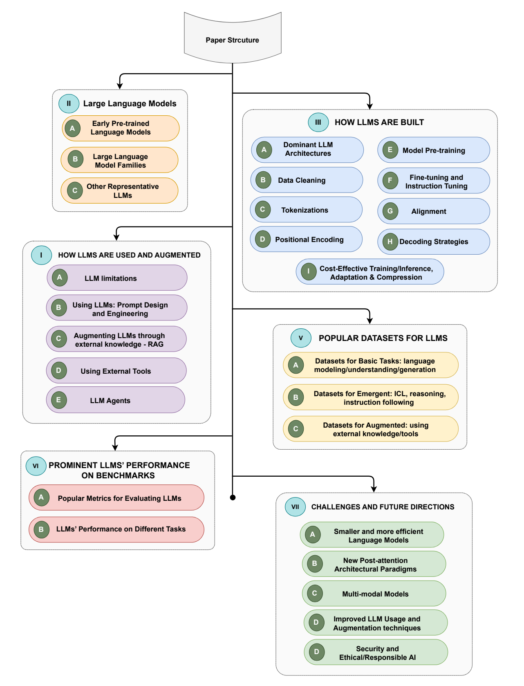
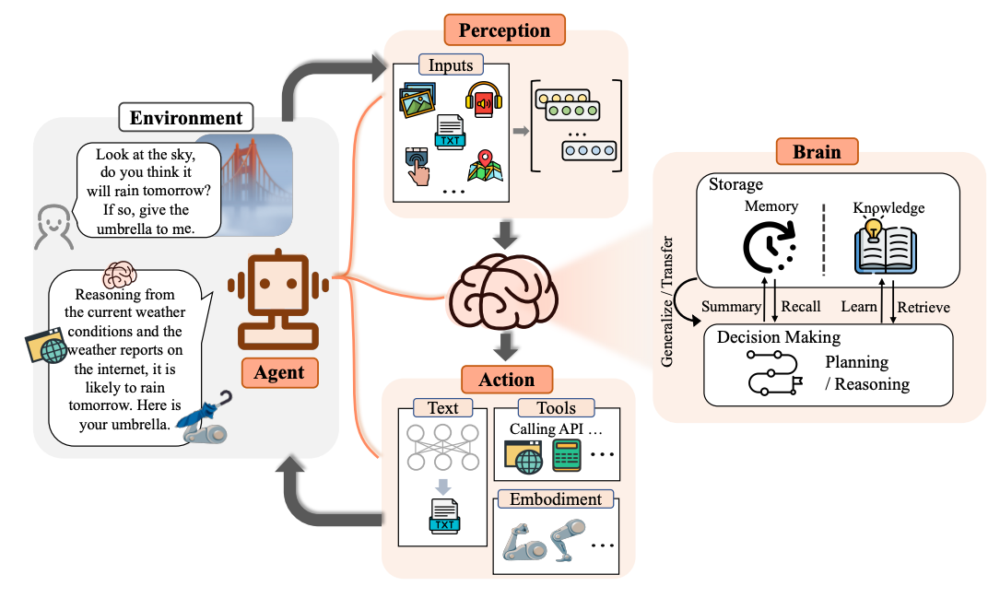
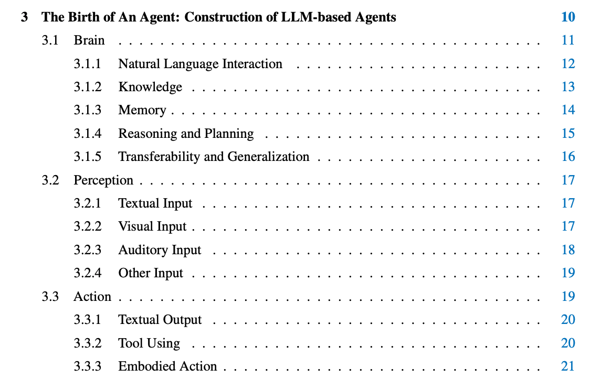

# Survey

> [Large Language Models: A Survey](https://arxiv.org/pdf/2402.06196)

## Structure



## Agent

### [The rise and potential of large language model based agents: A survey](https://arxiv.org/pdf/2309.07864)

> https://github.com/WooooDyy/LLM-Agent-Paper-List

What is AI Agent?


Components:
* brain
* perception
* action




### other

[Agent ai: Surveying the horizons of multimodal interaction](https://arxiv.org/pdf/2401.03568)

```txt
[173] L. Wang, C. Ma, X. Feng, Z. Zhang, H. Yang, J. Zhang, Z. Chen,
J. Tang, X. Chen, Y. Lin et al., “A survey on large language model
based autonomous agents,” arXiv preprint arXiv:2308.11432, 2023.
```
