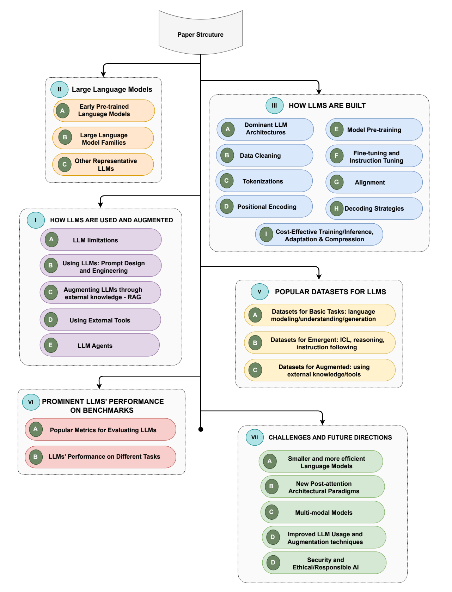
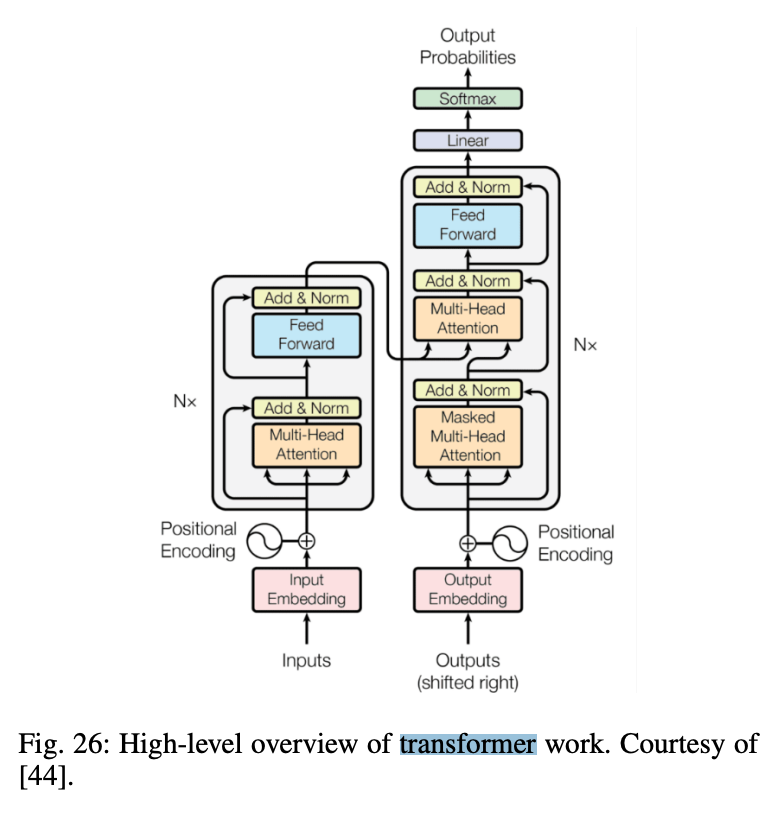
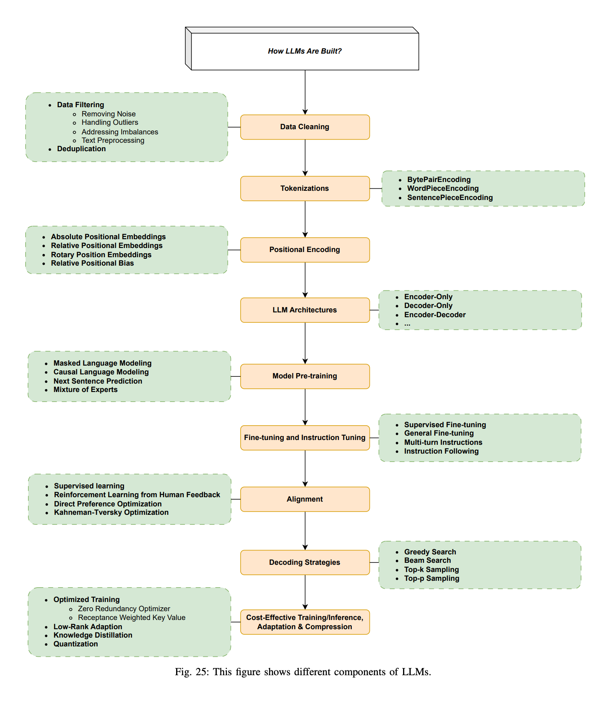
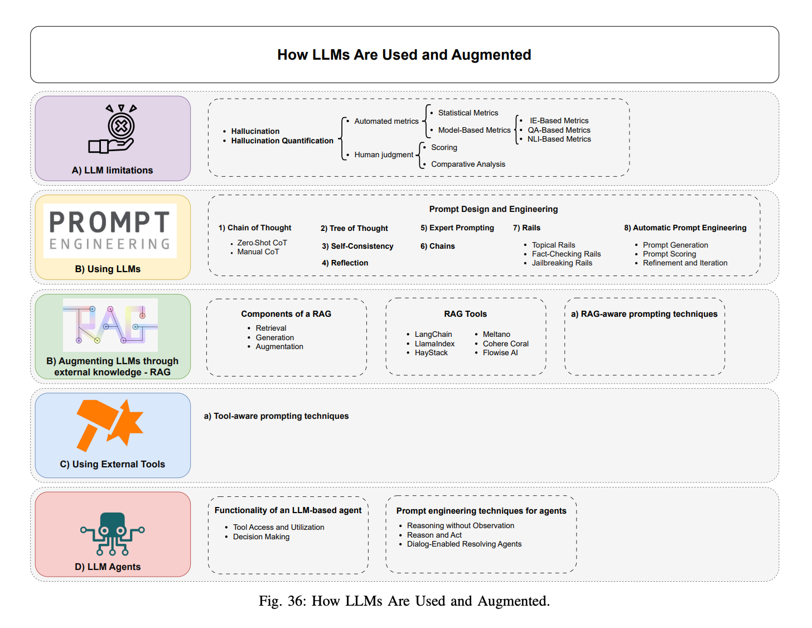
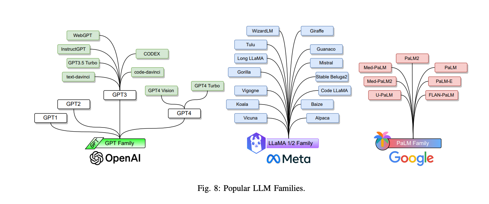
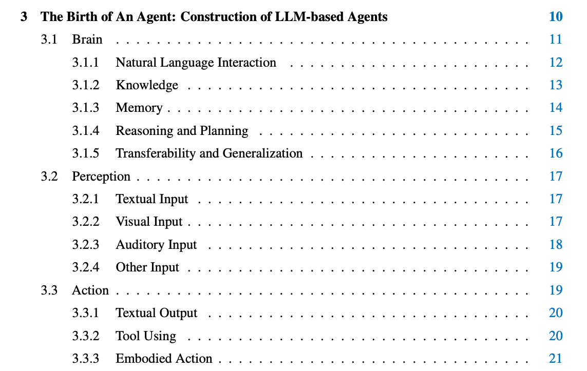
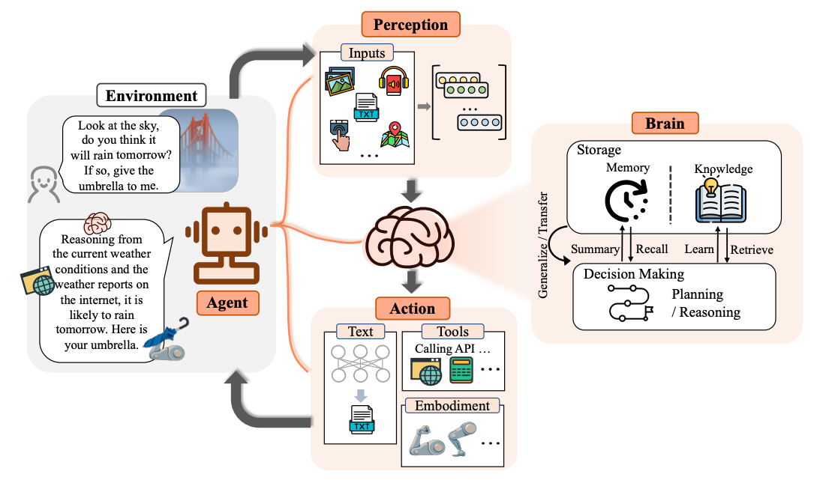
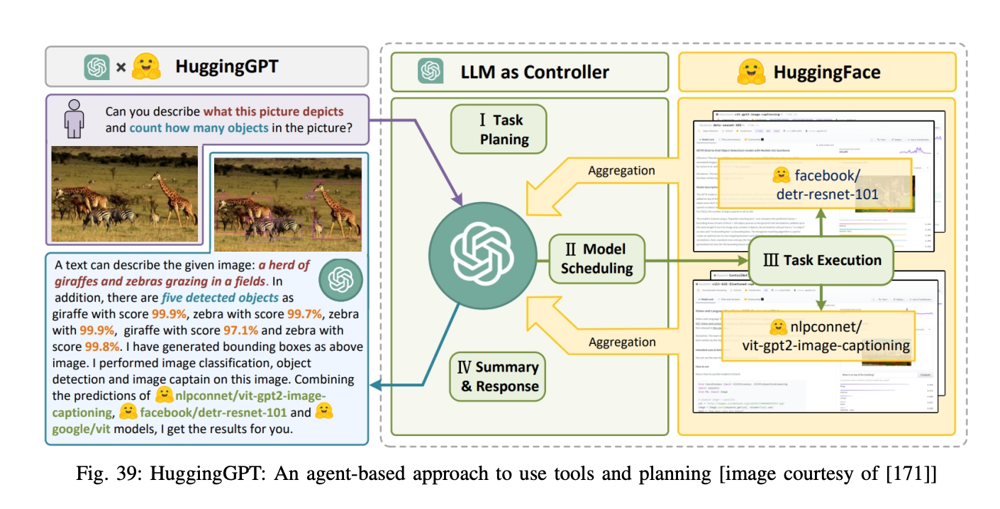
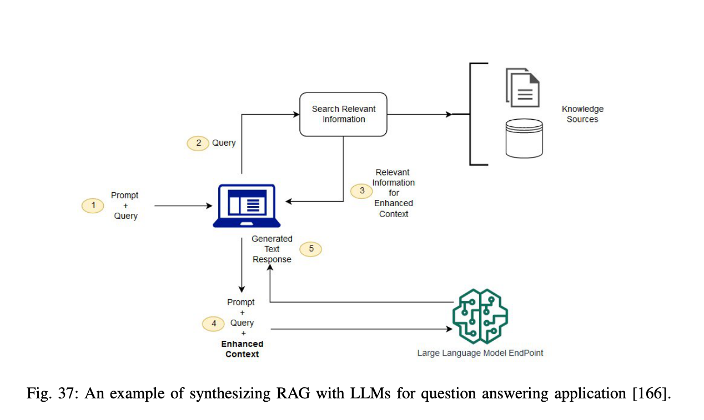

# Survey

> [Large Language Models: A Survey](https://arxiv.org/pdf/2402.06196) - LLM 综述，比较详细。介绍了如何 building, augmenting, and using LLMs
> [what is chatgpt doing](https://writings.stephenwolfram.com/2023/02/what-is-chatgpt-doing-and-why-does-it-work/) - 从原理层面介绍了 LLM，讲的清楚而且不怎么依赖读者有机器学习背景知识，nb

## Structure (Transformer)





## Train & Use 原理



### LLM 构建主要流程

Data cleaning -> tokenization -> positional encoding -> LLM arch -> Model Pretrain -> fine-tune -> alignment -> decoding strategies

tokenization 是什么意思？tokenization 和字符有什么区别？

### 调用 LLM（从处理输入到完成输出）的完整流程是什么样子的？


## Prompt 使用姿势

## Dataset

## Benchmark

## LLM 应用场景



## LLM Families



# Agent

## [The rise and potential of large language model based agents: A survey](https://arxiv.org/pdf/2309.07864)

> https://github.com/WooooDyy/LLM-Agent-Paper-List

## Agent 是什么东西？

抽象来说就是一个可以主动获取、处理数据，并做出合理响应以完成人类设定目标的软件（执行这些行为的过程都是软件自己决定的，人仅仅为其设立目标）。

其主体为三个部分，其实就很像是人的一个反射弧，有感受器、效应器还有中枢神经。

* brain - 决策系统，现在大家发现 LLM 很适合去承担这一责任
* perception - 效应器
* action - 执行



> https://aws.amazon.com/what-is/ai-agents/
An artificial intelligence (AI) agent is a software program that can interact with its environment, collect data, and use the data to perform self-determined tasks to meet predetermined goals. Humans set goals, but an AI agent independently chooses the best actions it needs to perform to achieve those goals. For example, consider a contact center AI agent that wants to resolves customer queries. The agent will automatically ask the customer different questions, look up information in internal documents, and respond with a solution. Based on the customer responses, it determines if it can resolve the query itself or pass it on to a human.
AI Agents are artificial entities that are using sensors to perceive surrounding environments, make decisions, and then taking actions in response using actuators.





## Agent 可以做什么？

Assist users in breaking free from daily tasks and repetitive labor, thereby Alleviating human work pressure and enhancing task-solving efficiency.
No longer necessitates users to provide explicit low-level instructions. Instead, the agent can independently analyze, plan, and solve problems.
After freeing users’ hands, the agent also liberates their minds to engage in exploratory and innovative work, realizing their full potential in cutting-edge scientific fields.

### other

[Agent ai: Surveying the horizons of multimodal interaction](https://arxiv.org/pdf/2401.03568)

```txt
[173] L. Wang, C. Ma, X. Feng, Z. Zhang, H. Yang, J. Zhang, Z. Chen,
J. Tang, X. Chen, Y. Lin et al., “A survey on large language model
based autonomous agents,” arXiv preprint arXiv:2308.11432, 2023.
```

https://eugeneyan.com/writing/llm-patterns/
https://writings.stephenwolfram.com/2023/02/what-is-chatgpt-doing-and-why-does-it-work/
https://waytoagi.feishu.cn/wiki/QPe5w5g7UisbEkkow8XcDmOpn8e


# Align

## Align 的意义是什么，为什么不能直接未 Align 的模型？

## RLHF 是什么东西？

# RAG



## 怎么理解 embedding？
