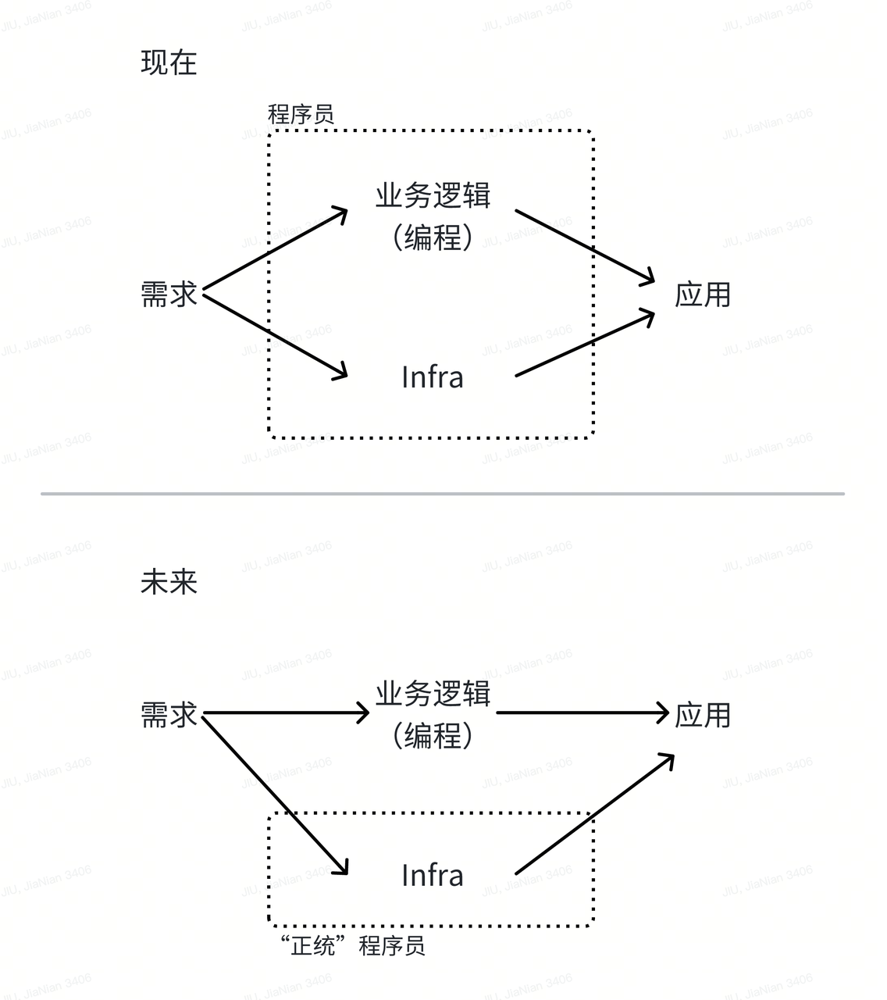

# AI 普及了，以后不再需要程序员了吗？

也许这句话更准确的描述是：随着技术越来越白菜化、平民化，程序员这个原本原子概念出现了分层，依然属于狭义定义下程序员的群体会大幅降低，但是广义的程序员会大幅增长。现在的程序员虽然区分 Infra 与业务，但本质还是一个群体，从外界视角观测下他们是一体的。我认为在未来完成二者工作的人群会有非常大的分化，这可能是 AI 时代对程序员的一个重大冲击（中性判断）。

具体来说：现有语境下的程序员（拥有编程能力并以此谋生的人）分成了依然以治理软件系统（软件运行所带来的运维复杂度更像是本质复杂度，无法被简单优化掉）为主要工作内容的“正统程序员”；以及掌握软件开发能力（通过自然语言）并通过该能力将抽象的需求生产成为应用的“编程能力拥有者”，编程能力对他们说像是“熟练使用 Excel”这样的亮眼的工作技能，而不是他们工作的本质属性。

在未来程序员这个概念所描述的人群会被收窄（单纯指负责 Infra 相关工作的软件开发者）。因为如果人人都是程序员，那程序员这个标签也就失去意义了；就如同过去因为只有部分人会使用电脑，所以会有电脑操作员这样的职业存在，但是现在人人都会操作电脑，所以又没人会说自己是电脑操作员了一样。

我认为程序语言以及基于其开发的软件，未来一定还是长期存在的，因为它是无论 AI 或人类与真实的硬件进行通信所必要的协议（基于目前的计算机架构，当然这可能也是我作为程序员的 bias）。如果把“人”与“软件”理解为一根数轴的两端，那么 LLM 更像是“人”而不是软件，因为它是基于自然语言而不是基于逻辑的。当然，模型底层还是一个复杂的函数，但是这个函数太复杂对于我们是个黑盒，因而我们现在只能通过分享它的输出来尝试理解它。而基于自然语言描述的信息又一定是含混模糊的，这也是为什么哪怕是人类自己也需要定义数学语言这种相对更严谨的 DSL 以便于自己在局部做严谨精确的计算。

拿我了解的 Github Copilot 为例，让 LLM 输出可理解的结构化结构，开发者做了大量复杂的 Prompt Engineering 建设，以至于 Prompt 接近定义一门 DSL 的程度。付出了这样的工程成本之后，LLM 才能够做到完成“理解给定的具体问题，输出可被其他程序理解的结果”这一工作。很难想象让 LLM（在提供屏幕渲染的函数接口的前提下）模拟一个完整的 VSCode 供用户使用需要多大的 Prompt 工程成本。即使那时的 LLM 足够聪明能做到这一点，我猜它也是自己设计一门程序语言然后编写代码来实现目标吧。
以上观点很大程度上受 [为什么大模型 LLM 不会取代软件？](https://mp.weixin.qq.com/s/0x7TTk5CW63p5UI257q2KQ) 启发，我认为这篇文章对软件与 AI 的区别有一个详细的分析，感兴趣可以看看。

计算机科学学习中培养的一个非常重要的素质是“把一个抽象描述的期望状态定义清晰，并拆解为若干具体可执行的操作”，此能力具体应用在“抽象建模”、“逻辑构建”等场景中。这项能力在 AI 时代依然有用甚至更加重要了。
举个例子，与 LLM 的对话和与“人”对话的一个巨大差异是，“人”在回答问题的时候拥有上文，即使问题的描述不清，“人”也可以基于他对你的先验理解进行“脑补”猜测出一个相对准确而完整的问题；但是 LLM 没有你的上文，哪怕它也进行“脑补”，脑补出的结果可能就和你所预料的完全不一样了。
那些高 level 的程序员的工作内容，可能就更贴近类似上述提到的本质能力，而不是“技术”。

无论是自然语言还是形式语言，内容结构化、有条理性非常重要，那个所谓“终极理想语言”至少需要支持大家能以严谨的形式表达内容。
而这一点是程序语言天然拥有优势的，因为绝大多数写出来的代码需要 1. 语法正确 2. 有明确解决的目的，所以天然的，代码的逻辑“质量”更高（但这不代表自然语言做不到程序语言的能力，只不过其需要更多的约束），程序语言鼓励并强迫大家做正确的事情。我觉得这也是为什么给 GPT3 喂代码会涌现很多原来没有的能力的原因。
不过，程序语言像是一个脚手架，能通过严格的语法规则约束人生成的代码，但是代价是表达力相较于自然语言差太多，因而只能是一个 DSL。最终更通用的信息表达方案一定是类自然语言（但是需要对其使用有更加严肃的分析和约束，一段语法混乱、逻辑不清的文字是不可能有表达力的）。
