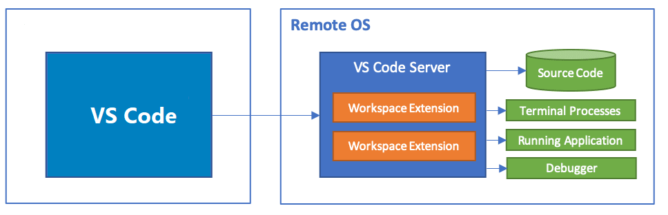

# VSCode 架构分析 - Electron 项目跨平台最佳实践

## 前言

VSCode 可以说是最为广为人知的 Electron 应用了。自其开源之后，凭借微软的钞能力不断完善与添加新能力，目前其已经成为世界上最为成功的 IDE（Editor）之一。现在，VSCode 不再仅仅是一个本地应用那么简单，而是支持 Web、Native、Remote 场景下的一整套产品方案，目前 VSCode 产品线下有 VSCode、vscode.dev、github.dev、code-server 等多个产品。令人惊奇的是，这些应用都是在一个非 monorepo 的仓库中完成的开发，并且其绝大多数功能都是同构的。本文将展示 VSCode 为实现同构的跨平台（Native & Web & Remote）能力而采用了哪些架构设计，并辅以少量源码分析各设计理念的意义。
本文假设读者对 Electron 有基础的了解。

在进行具体的架构分析之前，我们需要对同构与跨平台这两个名词的概念进行明确。

### 同构

同构是指同开发一个可以跑在不同的平台上的程序，例如开发一段 js 代码可以同时被基于 node.js 开发的 web server 和浏览器使用。由于 Web 侧天然被限制了一部分系统调用（如 fs 的读取等），所以在 VSCode 中实现完全的同构代码是不可能的，本文所提及的同构，更多是指如何通过抽象公共能力，以减少不同平台间差异代码数量的思想与原则。

### 跨平台

受益于 Electron 基于 Chromium 的架构，Electron App 天然的支持在不同操作系统下运行，因而这种概念的跨平台并非本文关注的重点。文中所提及的跨平台，更多的是指如何保证应用可以同时于 Electron App 以及浏览器中打开。换句话说，跨平台指的是跨 Electron 与 Web 平台。此外，在 VSCode 的设计中，还额外添加了 Remote 跨平台的诉求，即支持在本地 VSCode（Web & Native）中连接云上机器。简而言之，VSCode 的跨平台本质是实现下列两项能力：

1. Web & Native 间的同构
2. Native & Remote 间的同构

## Web & Native 间的同构

对依赖项运行环境的忽视是高发导致 Electron Render 进程无法运行在浏览器中的因素，反过来说，跨平台能力的核心也在于对依赖的治理。
举例来说，假设我们想要实现点击按钮后向用户弹窗提示`hello`的功能，一个很直接的实现方式如下：

```js
// Electron Render 环境下
function onClickButton() {
  ipcRender.invoke("showMessage", "hello!"); // it work
}
button.onclick = onClickButton;
```

然而，我们将项目运行在浏览器，就是这一行简单的 `ipcRender.invoke` 便会导致项目的报错。在这个具体的 case 下也许只是导致一个按钮点击的失灵，但是如果我们的初始化过程也依赖 ipc 调用呢？比如在初始化时读取用户的配置语言，在这种场景下报错导致的可能就是页面的白屏。

为了避免这些现象，VSCode 做了以下设计：

1. 从文件结构上明确代码运行环境
2. 通过依赖注入实现控制反转
3. 基于插件机制注册特定平台的特殊能力

### 项目文件组织结构的设计与依赖控制

观察 VSCode 核心逻辑实现代码文件夹`vscode/src/vs/platform`可以发现，每个子功能文件夹下都固定的放置 browser、common、electron-main、electron-sandbox、node、test 这几个文件夹，显而易见，这代表着文件夹下代码的运行环境。

```TXT
➜  vscode git:(main) ✗ tree src/vs/platform -L 2
src/vs/platform
├── accessibility
│   ├── browser
│   ├── common
│   └── test
├── action
│   └── common
├── actions
│   ├── browser
│   ├── common
│   └── test
├── assignment
│   └── common
├── backup
│   ├── common
│   ├── electron-main
│   ├── node
│   └── test
├── checksum
│   ├── common
│   ├── node
│   └── test
├── clipboard
│   ├── browser
│   ├── common
│   └── test
# ...
├── windows
│   ├── electron-main
│   ├── node
│   └── test
├── workspace
│   ├── common
│   └── test
└── workspaces
    ├── common
    ├── electron-main
    ├── node
    └── test

273 directories, 0 files
```

这一设计的关键在于为后续的若干治理手段提供了至关重要的元信息（运行环境），作为基石保证了依赖注入功能的可行性，其具体价值将在后续的内容中有更明显的展现。

### 依赖注入

依赖注入是整个 VSCode 跨平台架构中最重要的一环，可以说其他设计都只是起到对其的辅助或补充作用。本文不详细分析依赖注入的概念以及在 VSCode 的具体实现，感兴趣的可以阅读本篇文档：https://bytedance.feishu.cn/docs/doccnbj6lyJGeg7EP0Sqx8rTLvd。

让我们再回到上文中提到的例子，用朴素的思路实现与依赖注入的思路分别实现跨平台的按钮提示功能，从而观察依赖注入这种方案的优势所在。

#### 朴素实现

思路：注意到 ipcRender 不能在 Web 环境下调用，因此通过 if else 来区分不同环境下的执行逻辑。

```js
function onClickButton() {
  if (CURRENT_ENVIRONMENT === 'electron-sandbox') // electron
    (await import('electron')).ipcRender.invoke("showMessage", 'hello!');
  else // web
    alert('hello')
}
button.onclick = onClickButton
```

虽然实现了所需的功能，同时保证代码在 Web & Electron 中均可运行。但是随着 ipcRender 使用量的增多，代码的圈复杂度会大幅增长，进而影响项目可读性与效率。并且由于没有统一的架构设计，实现调用的方式也会千奇百怪，从而大幅提升后续功能治理的能力（换句话说就是很难升级接口）。

#### 依赖注入实现

思路：抽象出一个 `IMessageService` 接口，其中定义 `showMessage` 方法，在 electron-sandbox 与 Web 下分别实现这个接口，在 view 中获取当前环境下实例化的对象并绑定方法。

```ts
// common/message.ts
const IMessageService = Symbol("IMessageService");
interface IMessageService {
  showMessage(message: string): void;
}

// electron-sandbox/messageService.ts
class MessageService implements IMessageService {
  showMessage(message: string): void {
    ipcRender.invoke("showMessage", message);
  }
}
collection.registry(IMessageService, new MessageService());

// browser/messageService.ts
class MessageService implements IMessageService {
  showMessage(message: string): void {
    alert(message);
  }
}
collection.registry(IMessageService, new MessageService());

// browser/button.ts
const messageService = collection.get(IMessageService);
button.onclick = function () {
  messageService.showMessage("hello");
};
```

#### 分析

对于这样一个简单的功能，依赖注入的实现方式确实显得更加复杂，有着更多的代码量。但是，如果仅关注核心逻辑（`browser/button.ts` 文件）的话，依赖注入的模式显然是更清晰简洁的。并且，依赖注入的开发成本是一次性的：实现依赖注入之后，对相应服务方法的调用都不再需要添加 if else 的判断，长期来看整个项目的代码量与复杂度一定是下降的。项目的复杂度只是与代码数量成正相关，但不同项目的复杂度随代码行数的增长曲线完全不同。从这个角度来说，依赖注入显然是大型项目中的理想方案。

以 `ExtensionService` 为例，一个服务就依赖了其他的 18 个服务，而绝大多数的服务在不同的运行环境下都有不同的实现，如下面出现的 LogService、LifecycleService、FileService 等。
在这一个服务中调用上述三个服务的总次数就达到了 40+ 次，换句话说如果不使用依赖注入就需要 40+ 次的 if else 来判断，这就是在大型项目中依赖注入的意义。

```ts
export class ExtensionService
  extends AbstractExtensionService
  implements IExtensionService
{
  private _disposables = new DisposableStore();
  private _remoteInitData: IRemoteExtensionHostInitData | null = null;

  constructor(
    @IInstantiationService instantiationService: IInstantiationService,
    @INotificationService notificationService: INotificationService,
    @IWorkbenchEnvironmentService
    environmentService: IWorkbenchEnvironmentService,
    @ITelemetryService telemetryService: ITelemetryService,
    @IWorkbenchExtensionEnablementService
    extensionEnablementService: IWorkbenchExtensionEnablementService,
    @IFileService fileService: IFileService,
    @IProductService productService: IProductService,
    @IWorkbenchExtensionManagementService
    extensionManagementService: IWorkbenchExtensionManagementService,
    @IWorkspaceContextService contextService: IWorkspaceContextService,
    @IConfigurationService configurationService: IConfigurationService,
    @IExtensionManifestPropertiesService
    extensionManifestPropertiesService: IExtensionManifestPropertiesService,
    @IWebExtensionsScannerService
    private readonly _webExtensionsScannerService: IWebExtensionsScannerService,
    @ILogService logService: ILogService,
    @IRemoteAgentService remoteAgentService: IRemoteAgentService,
    @ILifecycleService lifecycleService: ILifecycleService,
    @IRemoteAuthorityResolverService
    private readonly _remoteAuthorityResolverService: IRemoteAuthorityResolverService,
    @IUserDataInitializationService
    private readonly _userDataInitializationService: IUserDataInitializationService,
    @IUserDataProfileService userDataProfileService: IUserDataProfileService
  ) {
    super(
      instantiationService,
      notificationService,
      environmentService,
      telemetryService,
      extensionEnablementService,
      fileService,
      productService,
      extensionManagementService,
      contextService,
      configurationService,
      extensionManifestPropertiesService,
      logService,
      remoteAgentService,
      lifecycleService,
      userDataProfileService
    );

    // Initialize installed extensions first and do it only after workbench is ready
    lifecycleService.when(LifecyclePhase.Ready).then(async () => {
      await this._userDataInitializationService.initializeInstalledExtensions(
        this._instantiationService
      );
      this._initialize();
    });

    this._initFetchFileSystem();
  }

  override dispose(): void {
    this._disposables.dispose();
    super.dispose();
  }

  protected async _scanSingleExtension(
    extension: IExtension
  ): Promise<IExtensionDescription | null> {
    if (extension.location.scheme === Schemas.vscodeRemote) {
      return this._remoteAgentService.scanSingleExtension(
        extension.location,
        extension.type === ExtensionType.System
      );
    }

    const scannedExtension =
      await this._webExtensionsScannerService.scanExistingExtension(
        extension.location,
        extension.type,
        this._userDataProfileService.currentProfile.extensionsResource
      );
    if (scannedExtension) {
      return toExtensionDescription(scannedExtension);
    }

    return null;
  }

  private _initFetchFileSystem(): void {
    const provider = new FetchFileSystemProvider();
    this._disposables.add(
      this._fileService.registerProvider(Schemas.http, provider)
    );
    this._disposables.add(
      this._fileService.registerProvider(Schemas.https, provider)
    );
  }

  private _createLocalExtensionHostDataProvider(
    desiredRunningLocation: ExtensionRunningLocation
  ): IWebWorkerExtensionHostDataProvider {
    return {
      getInitData: async (): Promise<IWebWorkerExtensionHostInitData> => {
        const allExtensions = await this.getExtensions();
        const localWebWorkerExtensions = this._filterByRunningLocation(
          allExtensions,
          desiredRunningLocation
        );
        return {
          autoStart: true,
          allExtensions: allExtensions,
          myExtensions: localWebWorkerExtensions.map(
            (extension) => extension.identifier
          ),
        };
      },
    };
  }

  private _createRemoteExtensionHostDataProvider(
    remoteAuthority: string
  ): IRemoteExtensionHostDataProvider {
    return {
      remoteAuthority: remoteAuthority,
      getInitData: async () => {
        await this.whenInstalledExtensionsRegistered();
        return this._remoteInitData!;
      },
    };
  }

  protected _pickExtensionHostKind(
    extensionId: ExtensionIdentifier,
    extensionKinds: ExtensionKind[],
    isInstalledLocally: boolean,
    isInstalledRemotely: boolean,
    preference: ExtensionRunningPreference
  ): ExtensionHostKind | null {
    const result = ExtensionService.pickRunningLocation(
      extensionKinds,
      isInstalledLocally,
      isInstalledRemotely,
      preference
    );
    this._logService.trace(
      `pickRunningLocation for ${
        extensionId.value
      }, extension kinds: [${extensionKinds.join(
        ", "
      )}], isInstalledLocally: ${isInstalledLocally}, isInstalledRemotely: ${isInstalledRemotely}, preference: ${extensionRunningPreferenceToString(
        preference
      )} => ${extensionHostKindToString(result)}`
    );
    return result;
  }

  public static pickRunningLocation(
    extensionKinds: ExtensionKind[],
    isInstalledLocally: boolean,
    isInstalledRemotely: boolean,
    preference: ExtensionRunningPreference
  ): ExtensionHostKind | null {
    const result: ExtensionHostKind[] = [];
    let canRunRemotely = false;
    for (const extensionKind of extensionKinds) {
      if (extensionKind === "ui" && isInstalledRemotely) {
        // ui extensions run remotely if possible (but only as a last resort)
        if (preference === ExtensionRunningPreference.Remote) {
          return ExtensionHostKind.Remote;
        } else {
          canRunRemotely = true;
        }
      }
      if (extensionKind === "workspace" && isInstalledRemotely) {
        // workspace extensions run remotely if possible
        if (
          preference === ExtensionRunningPreference.None ||
          preference === ExtensionRunningPreference.Remote
        ) {
          return ExtensionHostKind.Remote;
        } else {
          result.push(ExtensionHostKind.Remote);
        }
      }
      if (
        extensionKind === "web" &&
        (isInstalledLocally || isInstalledRemotely)
      ) {
        // web worker extensions run in the local web worker if possible
        if (
          preference === ExtensionRunningPreference.None ||
          preference === ExtensionRunningPreference.Local
        ) {
          return ExtensionHostKind.LocalWebWorker;
        } else {
          result.push(ExtensionHostKind.LocalWebWorker);
        }
      }
    }
    if (canRunRemotely) {
      result.push(ExtensionHostKind.Remote);
    }
    return result.length > 0 ? result[0] : null;
  }

  protected _createExtensionHost(
    runningLocation: ExtensionRunningLocation,
    _isInitialStart: boolean
  ): IExtensionHost | null {
    switch (runningLocation.kind) {
      case ExtensionHostKind.LocalProcess: {
        return null;
      }
      case ExtensionHostKind.LocalWebWorker: {
        return this._instantiationService.createInstance(
          WebWorkerExtensionHost,
          runningLocation,
          false,
          this._createLocalExtensionHostDataProvider(runningLocation)
        );
      }
      case ExtensionHostKind.Remote: {
        const remoteAgentConnection = this._remoteAgentService.getConnection();
        if (remoteAgentConnection) {
          return this._instantiationService.createInstance(
            RemoteExtensionHost,
            runningLocation,
            this._createRemoteExtensionHostDataProvider(
              remoteAgentConnection.remoteAuthority
            ),
            this._remoteAgentService.socketFactory
          );
        }
        return null;
      }
    }
  }

  private async _scanWebExtensions(): Promise<IExtensionDescription[]> {
    const system: IExtensionDescription[] = [],
      user: IExtensionDescription[] = [],
      development: IExtensionDescription[] = [];
    try {
      await Promise.all([
        this._webExtensionsScannerService
          .scanSystemExtensions()
          .then((extensions) =>
            system.push(...extensions.map((e) => toExtensionDescription(e)))
          ),
        this._webExtensionsScannerService
          .scanUserExtensions(
            this._userDataProfileService.currentProfile.extensionsResource,
            { skipInvalidExtensions: true }
          )
          .then((extensions) =>
            user.push(...extensions.map((e) => toExtensionDescription(e)))
          ),
        this._webExtensionsScannerService
          .scanExtensionsUnderDevelopment()
          .then((extensions) =>
            development.push(
              ...extensions.map((e) => toExtensionDescription(e, true))
            )
          ),
      ]);
    } catch (error) {
      this._logService.error(error);
    }
    return dedupExtensions(system, user, development, this._logService);
  }

  protected async _scanAndHandleExtensions(): Promise<void> {
    // fetch the remote environment
    let [localExtensions, remoteEnv, remoteExtensions] = await Promise.all([
      this._scanWebExtensions(),
      this._remoteAgentService.getEnvironment(),
      this._remoteAgentService.scanExtensions(),
    ]);
    localExtensions = this._checkEnabledAndProposedAPI(localExtensions, false);
    remoteExtensions = this._checkEnabledAndProposedAPI(
      remoteExtensions,
      false
    );

    const remoteAgentConnection = this._remoteAgentService.getConnection();
    // `determineRunningLocation` will look at the complete picture (e.g. an extension installed on both sides),
    // takes care of duplicates and picks a running location for each extension
    this._initializeRunningLocation(localExtensions, remoteExtensions);

    // Some remote extensions could run locally in the web worker, so store them
    const remoteExtensionsThatNeedToRunLocally =
      this._filterByExtensionHostKind(
        remoteExtensions,
        ExtensionHostKind.LocalWebWorker
      );
    localExtensions = this._filterByExtensionHostKind(
      localExtensions,
      ExtensionHostKind.LocalWebWorker
    );
    remoteExtensions = this._filterByExtensionHostKind(
      remoteExtensions,
      ExtensionHostKind.Remote
    );

    // Add locally the remote extensions that need to run locally in the web worker
    for (const ext of remoteExtensionsThatNeedToRunLocally) {
      if (!includes(localExtensions, ext.identifier)) {
        localExtensions.push(ext);
      }
    }

    const result = this._registry.deltaExtensions(
      remoteExtensions.concat(localExtensions),
      []
    );
    if (result.removedDueToLooping.length > 0) {
      this._notificationService.notify({
        severity: Severity.Error,
        message: nls.localize(
          "looping",
          "The following extensions contain dependency loops and have been disabled: {0}",
          result.removedDueToLooping
            .map((e) => `'${e.identifier.value}'`)
            .join(", ")
        ),
      });
    }

    if (remoteEnv && remoteAgentConnection) {
      // save for remote extension's init data
      this._remoteInitData = {
        connectionData: this._remoteAuthorityResolverService.getConnectionData(
          remoteAgentConnection.remoteAuthority
        ),
        pid: remoteEnv.pid,
        appRoot: remoteEnv.appRoot,
        extensionHostLogsPath: remoteEnv.extensionHostLogsPath,
        globalStorageHome: remoteEnv.globalStorageHome,
        workspaceStorageHome: remoteEnv.workspaceStorageHome,
        allExtensions: this._registry.getAllExtensionDescriptions(),
        myExtensions: remoteExtensions.map((extension) => extension.identifier),
      };
    }

    this._doHandleExtensionPoints(this._registry.getAllExtensionDescriptions());
  }

  public _onExtensionHostExit(code: number): void {
    // Dispose everything associated with the extension host
    this.stopExtensionHosts();

    const automatedWindow = window as unknown as IAutomatedWindow;
    if (typeof automatedWindow.codeAutomationExit === "function") {
      automatedWindow.codeAutomationExit(code);
    }
  }
}
```

#### 跨进程的服务间调用

依赖注入带来的另外一个收益是极大的简化了跨进程的服务间调用的成本。受益于依赖注入的架构，VSCode 的功能均是以 Class 的形式进行组织，并且有着相对一致的结构和共有的约定。基于这些背景，VSCode 可以很轻松的完成对跨进程间服务的代理与包装，从而方便的完成跨进程的服务间调用。相较于手动注册 Electron Channel 的方式，这种基于 Proxy 的方式既享受了 TypeScript 强大的类型检查支持，还自动化了注册 channel 的流程。

```ts
export function fromService<TContext>(
  service: unknown,
  options?: ICreateServiceChannelOptions
): IServerChannel<TContext> {
  const handler = service as { [key: string]: unknown };
  const disableMarshalling = options && options.disableMarshalling;

  // Buffer any event that should be supported by
  // iterating over all property keys and finding them
  const mapEventNameToEvent = new Map<string, Event<unknown>>();
  for (const key in handler) {
    if (propertyIsEvent(key)) {
      mapEventNameToEvent.set(
        key,
        Event.buffer(handler[key] as Event<unknown>, true)
      );
    }
  }

  return new (class implements IServerChannel {
    listen<T>(_: unknown, event: string, arg: any): Event<T> {
      const eventImpl = mapEventNameToEvent.get(event);
      if (eventImpl) {
        return eventImpl as Event<T>;
      }

      if (propertyIsDynamicEvent(event)) {
        const target = handler[event];
        if (typeof target === "function") {
          return target.call(handler, arg);
        }
      }

      throw new Error(`Event not found: ${event}`);
    }

    call(_: unknown, command: string, args?: any[]): Promise<any> {
      const target = handler[command];
      if (typeof target === "function") {
        // Revive unless marshalling disabled
        if (!disableMarshalling && Array.isArray(args)) {
          for (let i = 0; i < args.length; i++) {
            args[i] = revive(args[i]);
          }
        }

        return target.apply(handler, args);
      }

      throw new Error(`Method not found: ${command}`);
    }
  })();
}

export function toService<T extends object>(
  channel: IChannel,
  options?: ICreateProxyServiceOptions
): T {
  const disableMarshalling = options && options.disableMarshalling;

  return new Proxy(
    {},
    {
      get(_target: T, propKey: PropertyKey) {
        if (typeof propKey === "string") {
          // Check for predefined values
          if (options?.properties?.has(propKey)) {
            return options.properties.get(propKey);
          }

          // Dynamic Event
          if (propertyIsDynamicEvent(propKey)) {
            return function (arg: any) {
              return channel.listen(propKey, arg);
            };
          }

          // Event
          if (propertyIsEvent(propKey)) {
            return channel.listen(propKey);
          }

          // Function
          return async function (...args: any[]) {
            // Add context if any
            let methodArgs: any[];
            if (options && !isUndefinedOrNull(options.context)) {
              methodArgs = [options.context, ...args];
            } else {
              methodArgs = args;
            }

            const result = await channel.call(propKey, methodArgs);

            // Revive unless marshalling disabled
            if (!disableMarshalling) {
              return revive(result);
            }

            return result;
          };
        }

        throw new Error(`Property not found: ${String(propKey)}`);
      },
    }
  ) as T;
}
```

举一个真实的例子：

```ts
// src/vs/code/electron-main/app.ts
const requestService = new RequestChannel(accessor.get(IRequestService));
sharedProcessClient.then((client) =>
  client.registerChannel("request", requestService)
);

// src/vs/platform/request/common/requestIpc.ts
services.set(
  IRequestService,
  ProxyChannel.toService(client.registerChannel("request"))
);

// another file
class XXXService {
  constructor(@IRequestService requestService: IRequestService) {
    this.requestService.request(xxx);
  }
}
```

### 基于插件机制注册特定平台的特殊能力

受益于 VSCode 设计精巧的插件体系，VSCode 可以把一些非核心的能力从代码中提取出来，将其放置于插件中实现。如 VSCode 对 JavaScript 的调试能力，其实都是实现于内置的插件 `Node Debug Auto-attach` 中，在 Web 下只需将这样的插件从构建产物中移除即可对相关能力实现删减。
同理，一些在 Web 中必须的能力也可以通过内置插件的形式提供，比如 github.dev 下就内置安装了 `GitHub Pull Requests and Issues` 插件以支持用户在应用中便捷的进行 Code Review。
通过增减内置插件的数量，可以保障 VSCode 核心代码中逻辑圈复杂度的进一步减少，从而保障了 VSCode 本体的性能与复杂度。

## Native & Remote 间的同构

### 进程结构的抽象

毫无疑问，VSCode Remote 系列能力（Remote SSH、code-server...）是其区别于其他 IDE 的核心竞争能力之一。为了实现 Remote 连接和本地 Electron App 使用体验的一致性，VSCode 封装了一整套 ipc 通信的协议以抹平本地 VSCode 与连接云端服务间的差异。其架构图如下所示：


当用户使用 VSCode App 时，其通过 Electron 的提供的 ipc 接口与运行于本地的 VSCode Server 通信，而在 code-server 或 SSH 模式下，Render 进程则通过 websocket 或 SSH 协议与云端的服务器进行通信。这其中不同的只有通信协议，调用方法的返回结果则基本一致。通过这样的架构设计，VSCode 保证 Native & Remote 间体验的一致性，也为 VSCode Remote 系列能力的成功打下了坚实的基础。

```ts
// src/vs/base/parts/ipc/common/ipc.ts
/**
 * An `IChannel` is an abstraction over a collection of commands.
 * You can `call` several commands on a channel, each taking at
 * most one single argument. A `call` always returns a promise
 * with at most one single return value.
 */
export interface IChannel {
  call<T>(
    command: string,
    arg?: any,
    cancellationToken?: CancellationToken
  ): Promise<T>;
  listen<T>(event: string, arg?: any): Event<T>;
}

/**
 * An `IServerChannel` is the counter part to `IChannel`,
 * on the server-side. You should implement this interface
 * if you'd like to handle remote promises or events.
 */
export interface IServerChannel<TContext = string> {
  call<T>(
    ctx: TContext,
    command: string,
    arg?: any,
    cancellationToken?: CancellationToken
  ): Promise<T>;
  listen<T>(ctx: TContext, event: string, arg?: any): Event<T>;
}

// src/vs/base/parts/ipc/electron-sandbox/ipc.electron.ts
/**
 * An implementation of `IPCClient` on top of Electron `ipcRenderer` IPC communication
 * provided from sandbox globals (via preload script).
 */
export class Client extends IPCClient implements IDisposable {
  private protocol: ElectronProtocol;

  private static createProtocol(): ElectronProtocol {
    const onMessage = Event.fromNodeEventEmitter<VSBuffer>(
      ipcRenderer,
      "vscode:message",
      (_, message) => VSBuffer.wrap(message)
    );
    ipcRenderer.send("vscode:hello");

    return new ElectronProtocol(ipcRenderer, onMessage);
  }

  constructor(id: string) {
    const protocol = Client.createProtocol();
    super(protocol, id);

    this.protocol = protocol;
  }

  override dispose(): void {
    this.protocol.disconnect();
  }
}

// src/vs/base/parts/ipc/common/ipc.net.ts
export class Protocol extends Disposable implements IMessagePassingProtocol {
  private _socket: ISocket;
  private _socketWriter: ProtocolWriter;
  private _socketReader: ProtocolReader;

  private readonly _onMessage = new Emitter<VSBuffer>();
  readonly onMessage: Event<VSBuffer> = this._onMessage.event;

  private readonly _onDidDispose = new Emitter<void>();
  readonly onDidDispose: Event<void> = this._onDidDispose.event;

  constructor(socket: ISocket) {
    super();
    this._socket = socket;
    this._socketWriter = this._register(new ProtocolWriter(this._socket));
    this._socketReader = this._register(new ProtocolReader(this._socket));

    this._register(
      this._socketReader.onMessage((msg) => {
        if (msg.type === ProtocolMessageType.Regular) {
          this._onMessage.fire(msg.data);
        }
      })
    );

    this._register(this._socket.onClose(() => this._onDidDispose.fire()));
  }

  drain(): Promise<void> {
    return this._socketWriter.drain();
  }

  getSocket(): ISocket {
    return this._socket;
  }

  sendDisconnect(): void {
    // Nothing to do...
  }

  send(buffer: VSBuffer): void {
    this._socketWriter.write(
      new ProtocolMessage(ProtocolMessageType.Regular, 0, 0, buffer)
    );
  }
}

export class Client<TContext = string> extends IPCClient<TContext> {
  static fromSocket<TContext = string>(
    socket: ISocket,
    id: TContext
  ): Client<TContext> {
    return new Client(new Protocol(socket), id);
  }

  get onDidDispose(): Event<void> {
    return this.protocol.onDidDispose;
  }

  constructor(
    private protocol: Protocol | PersistentProtocol,
    id: TContext,
    ipcLogger: IIPCLogger | null = null
  ) {
    super(protocol, id, ipcLogger);
  }

  override dispose(): void {
    super.dispose();
    const socket = this.protocol.getSocket();
    this.protocol.sendDisconnect();
    this.protocol.dispose();
    socket.end();
  }
}
```

## 参考资料

### vscode server

- https://code.visualstudio.com/blogs/2021/10/20/vscode-dev
- https://code.visualstudio.com/blogs/2022/07/07/vscode-server
- https://code.visualstudio.com/docs/remote/vscode-server
- https://www.youtube.com/watch?v=sy3TUb_iVJM

### 依赖注入

- https://bytedance.feishu.cn/docs/doccnbj6lyJGeg7EP0Sqx8rTLvd

### contribute

- https://www.wendell.fun/posts/vscode-contrib

[[status/ArticlePublished]] [[status/Archived]]
