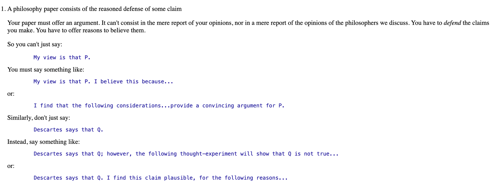

- ask ai 和哲学研究的共通之处

Q：不懂就问，把类似 chatgpt，ai 类的当作学习工具需不需要考虑反馈信息真实性的问题？想的是如果后面有监管什么的，搜索一些话题出来的东西是相反的，改造过的，或者说是局限的。

A：

问题很有代表性，我觉得产生这样困惑的本质原因在于问题隐含了一些错误的预设。

随着 AI 的高速发展，在工作生活中人们开始广泛的应用 AI，但由于 AI 回答出现幻觉（既答案与事实不符）的可能性，我们无法不加分析便直接采纳 AI 的回答。问题也随之而来：为什么使用 AI 这么麻烦？既然 AI 回答事实上存在幻觉，我们该如何合理的使用 AI 呢？

我认为，在教育阶段人们被灌输的解决问题的方式与现实情况脱节，是给人们带来上述困扰的本质原因。

在教育阶段，人们往往会被灌输的如下这般的观念：任何问题都会有一个官方给出的正确答案。如果你的观点和它不同，那你做错了它是对的。换句话说，存在一个“绝对权威”为每个问题给出结果。

但事实上，在生活或者学术研究中，往往不存在这样一个确定的答案。我们要做的应该是从已知的一些假说中选择我们觉着合理正确的，并给出它的证明（如果后续发现此假说错误甚至还要再推倒重来）；我们不应该期待有一个权威给人以正确答案。

真实场景的复杂度被人为的在教育阶段隐藏了起来，因而给人以这样的幻觉：解决问题的重点不是分析问题，而是找到足够置信的信息源（既教育阶段中辅导书里面的“参考答案”）。

那如果这样的确定答案不存在，我们又该怎么寻求真实呢？

引入一些哲学研究的方法论有助于人们解决这个问题。

当我们提及哲学研究的时，我们并不把它当做一种寻求绝对真理的途径，而是把它当做一种证明和分析的过程。当我们提到某人或者我认为 A 是对的时候，我们不能止步于此，而需要延伸开来阐明：为什么我觉着它正确，理由有哪些。或者说，如果我认为它不对，有哪一些反例指出了其矛盾之处。其他人的阐述只是一个可真可假的命题，而我要做的是尝试理解并证明或证伪。

举个例子：在哲学研究中，研究的重点往往不在某人（哪怕他享有盛名）说了什么，而在于对特定命题的讨论。下图便很清晰的表明了这一点：谁说了一个命题并不重要，重要的是他的论证过程。某人对命题如何阐述、他是如何尝试证明命题，以及他的假设都有什么、其他人对他的论证有什么攻击和质疑，这些问题才是关键，“某人” 往往只是作为一个承载句子的主语而并非关注的重心。

AI 的回答其实就类似这样的一个命题。由于幻觉的存在，我们并不能假设 AI 的答案跟狭义的计算器一样精确无误（当然如果你的提问只涉及到一些事实的阐述而不是观点，那我们也可以适当放松对回答的批判，毕竟事实性问题的验证往往容易很多）。其回答只能是一种参考，我们需要有选择地理解并批判接收他。通过自己的分析思考，确认它的结论是可以被接受的命题，还是存在问题需要改善或者拒斥的。

随着 AI 智能程度的不断增加，那些现实生活中已经有确定结论的命题可以被我们更轻易地检索到，因而人们不再需要花费过多的精力和资源去记忆这些内容。所以，我觉得这种类似哲学研究式的分析不确定性问题的能力显得就更为重要了，甚至是 AI 时代人必须掌握的一项能力。
